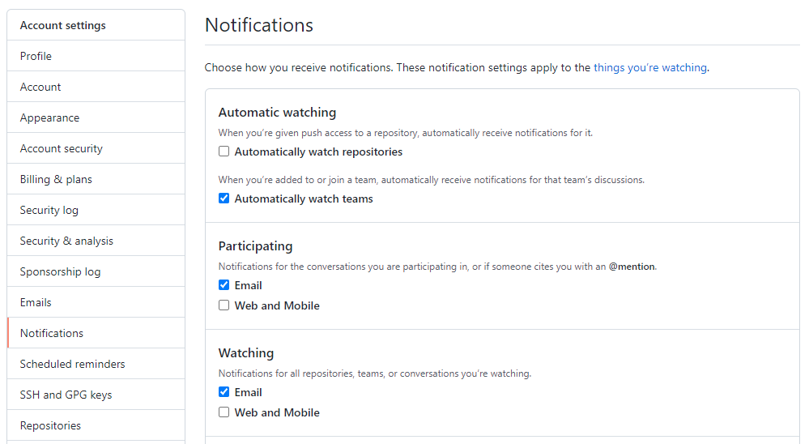

# Data690_MathML
A place to ask questions and collaborate with peers

# Github Rules

* Don’t push to main: Please establish your own branch off of main.
* When posting an issue, have a descriptive subject line specifying SQL, Python, or another topic
* * Ex:  Subject Line:  Python Pandas How to query a dataframe
* In subject line please state when you would like feedback/help by
* We all have expertise. :-) If you have something something to contribute, please respond to keep the conversation going.
* All class members should "watch" the class github page and accept automatic emails

 

